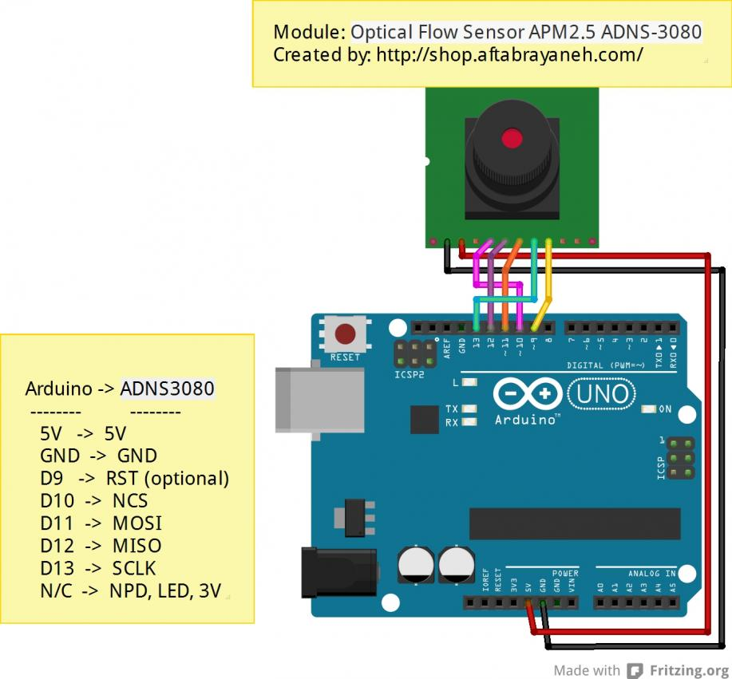

# ADNS3080
This is an Arduino library for ADNS3080 mouse sensor. It provides a simple interface to retrieve motion and frame data from the sensor. 

Credit goes to Lauszus and Neumi for on their code to get the sensor to work with arduino. This library is essentially a repackaging of their code into a neater form.  

See these links for their work:  
https://github.com/Lauszus/ADNS3080  
https://github.com/Neumi/OpticalFlowA3080ArduinoProcessing

For more information on this sensor see the datasheet:  
https://people.ece.cornell.edu/land/courses/ece4760/FinalProjects/s2009/ncr6_wjw27/ncr6_wjw27/docs/adns_3080.pdf

The sensor is generally sold as a module with a lens attached. This code was written around such a module. The following schematic shows how to connect the module to an arduino uno. It's the same for other boards except the SPI spins change. 

 

The schematic was found here:  
http://forum.arduino.ir/8/21/391.html
